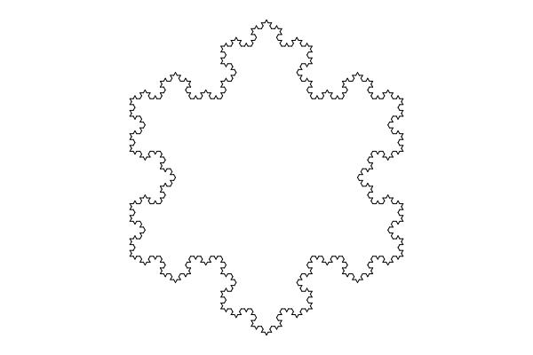

# Koch
## Create a picture of the Koch snowflake

The main function in this module is `snowflake` that is used to draw
a picture of the Koch snowflake curve. It takes one parameter that 
determines the number of iterations to perform. The default is four
iterations and this is the result:

